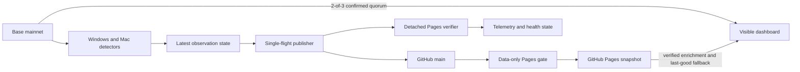

# Low-Latency Mission 3 Auction Data Design

Date: 2026-08-30

Status: Approved architecture, pending implementation plan

Repository: `ael-dev3/Degen-Dogs-Mission-3`

## Summary

The Mission 3 dashboard must show the newest auction state within seconds when a viewer opens or returns to the page, without weakening the existing cross-provider accuracy checks or the durable Git audit trail.

The selected design is a hybrid:

1. The browser reads the current auction from three fixed, public Base RPC providers and renders only after two independent providers agree at the same confirmed block.
2. The existing content-addressed GitHub Pages snapshot remains the enriched, durable last-good fallback and archive source.
3. The Windows runner's detector is separated from publishing and Pages verification so a slow deployment cannot prevent detection of a later bid.
4. Data-only Pages deployments use a focused fail-closed validation lane, while the complete CI suite continues independently.

This design requires no new hosted service or account. It intentionally accepts the approved privacy tradeoff that a viewer's IP address is visible to the public RPC providers.

## Goals

- Show a newly confirmed bid, bidder, auction extension, settlement, or auction transition within 8 seconds at p95 when at least two configured RPC providers are healthy.
- Preserve one-block confirmation and a minimum two-provider quorum.
- Never replace a newer accepted view with an older block.
- Keep a usable, verified last-good dashboard when live RPC or publication is unavailable.
- Continue polling for new auction state while an earlier snapshot is being generated, pushed, or deployed.
- Coalesce bursts so the newest observation wins without publishing unbounded intermediate snapshots.
- Keep Git commits and GitHub Pages as the durable audit/fallback path.
- Make freshness visible in seconds and by exact Base block.

## Non-goals

- Moving the historical archive out of GitHub Pages.
- Removing full CI, cryptographic bundle checks, or existing publisher safety checks.
- Reducing the RPC quorum below two providers or publishing an unconfirmed head block.
- Exposing credentialed runner RPC URLs or any secret to browser JavaScript.
- Making public RPC availability an uptime guarantee.
- Resolving new Farcaster identities or recomputing all reward projections in the browser.
- Adding a Cloudflare Worker, WebSocket service, service worker, or new hosted database in this iteration.

## Current-State Evidence

The local detector is not the dominant delay:

- The Windows watcher runs about every 15 seconds and recent quorum scans averaged about 2.1 seconds.
- A measured event-driven refresh reached GitHub 22 seconds after detection.
- Recent successful GitHub Pages deployments took 85-118 seconds, with a 95-second median across the sampled data deployments.
- One representative Pages build spent 57 seconds rerunning the broad validation suite even though full CI ran independently and the publisher had already performed production artifact validation.
- Mutable Pages JSON is served with a 600-second cache policy. Query parameters and request cache directives did not reliably bypass the observed CDN object.
- The watcher holds the shared refresh lock while the publisher waits for Pages. Other watcher invocations therefore skip observation for roughly 85-116 seconds during a deployment.
- The browser already polls Pages every 5 seconds, verifies the content-addressed live bundle, pauses while hidden, and refreshes immediately on visibility. Faster Pages polling cannot remove the deployment/CDN delay.

Three public Base endpoints were probed from the deployment host with the dashboard origin. All accepted cross-origin JSON-RPC requests, reported Base chain ID `8453`, and agreed byte-for-byte on a one-confirmation block hash and `auction()` result. Observed median head-request latency was approximately 85-212 ms:

- `https://mainnet.base.org`
- `https://base-rpc.publicnode.com`
- `https://base-mainnet.g.alchemy.com/public`

These endpoints are public, fixed in reviewed source, and contain no credentials.

## Alternatives Considered

### Selected: browser quorum plus durable static fallback

The page obtains the latency-critical contract state directly from Base using a two-of-three quorum, while Pages supplies verified enrichment and fallback data. This removes GitHub deployment and CDN promotion from the critical viewer path. It is the fastest deployable option without introducing another service.

Tradeoffs: every visible viewer generates a small amount of public RPC traffic, provider rate limits remain possible, and the viewer's IP is disclosed to each contacted provider. Fail-closed fallback and bounded polling limit these risks.

### Edge live-data service

A small authenticated edge service could accept runner-published bundles and deliver them with `no-store`, SSE, or WebSockets. It would centralize provider traffic and conceal viewer IPs from RPC providers. It also adds an account, credentials, storage consistency decisions, operational ownership, and another outage domain. It is deferred because the selected browser quorum can meet the target without new infrastructure.

### GitHub-only fast deployment

A focused Pages workflow can reduce deployment time materially, but Actions scheduling, Pages deployment, and CDN caching prevent a seconds-level guarantee. This remains part of the fallback optimization, not the live data plane.

## Architecture

The live browser path and durable publication path are independent. A Pages delay must not stop live reads, and a public RPC failure must not remove the last verified Pages snapshot.

## Browser Live Quorum

### Provider and request policy

- The three public origins are an exact allowlist in Content Security Policy `connect-src`.
- Browser code uses only fixed JSON-RPC methods, the verified Base chain ID, the verified auction-house address, and the reviewed `auction()` selector.
- No user-provided RPC URL, contract address, block tag, or method is accepted.
- Requests use POST, explicit JSON content type, bounded response sizes, `AbortController` timeouts, and strict JSON-RPC result validation.
- Each phase has a 2.5-second deadline and each response is streamed through a 1 MiB hard cap before JSON parsing. A late provider is discarded rather than allowed to extend a successful two-provider cycle.
- `eth_chainId` and the auction-house bytecode hash are checked at session start, whenever the static attestation changes, and periodically during a long visible session. The bytecode must match the last verified static attestation before direct state is eligible to render.
- The full-gated HTML contains an immutable bootstrap attestation with the chain ID, auction-house address, selector, and last verified auction-house bytecode SHA-256. The direct path can therefore start when mutable `refresh_status.json` is delayed. Only a later full-gated source/config deployment may rotate these bootstrap values.

### Quorum algorithm

On page load, when a hidden page becomes visible, on network reconnection, and every three seconds while visible:

1. Probe all three providers concurrently for their latest block numbers.
2. Reject wrong-chain, malformed, timed-out, oversized, or regressing responses.
3. Sort the valid heads. For a two-of-three quorum, choose the second-highest head as the quorum head. This is deterministic and ignores one arbitrarily low outlier.
4. Select the quorum head minus one confirmation as the target block.
5. Ask every valid provider that reported a head at or above the target for that exact block header and `auction()` result.
6. Group responses by exact block number, block hash, and raw ABI result. Accept only a group containing at least two distinct providers.
7. Require a block timestamp no more than 30 seconds old or 30 seconds in the future according to the browser clock, a monotonic block number, and an exact six-word auction ABI result before decoding. A client with an inaccurate clock fails closed to the static snapshot.
8. Decode token ID, exact bid wei, start time, end time, high bidder, and settled flag. Bid wei and other uint256 values remain `BigInt` or canonical decimal strings end-to-end. Reject invalid booleans, addresses, timestamps, unsafe numeric conversions, or unexpected ABI length.

The browser records the accepted block, hash, timestamp, agreeing-provider count, and observation time. A single provider can never update the UI.

### Polling and failure behavior

- Successful visible polling targets a three-second interval measured from the start of the prior cycle, with small per-session jitter to avoid synchronized bursts.
- Only one quorum cycle may be active at a time.
- One failed provider does not slow a successful two-provider quorum past the bounded phase deadline.
- If quorum fails, the direct view remains on its last accepted block and retries with bounded exponential backoff, capped at 30 seconds.
- Returning to a visible tab or regaining network connectivity triggers an immediate request and resets the retry delay.
- Hidden tabs make no live RPC requests.
- Normal ordering uses block number and hash. A direct snapshot may advance but may not regress. Static data at the same height may replace direct fields only when its block hash and decoded auction state agree.
- A two-provider equal-height hash change is treated as a canonical reorg and may replace the prior direct snapshot. If all available heads temporarily fall below the accepted height, retain the last-good values but mark them stale/non-live until quorum catches up; never present the orphaned observation as fresh.

### Rendering and source precedence

The static snapshot hydrates the complete card, archive, metadata, identities, prices, rewards, and bid history. The direct snapshot overlays only latency-critical on-chain fields:

- current Dog token ID;
- exact native bid amount;
- high-bidder wallet;
- start and end timestamps;
- live, ended, or settled state;
- accepted Base block and freshness.

Rendering rules prevent stale enrichment from masquerading as current data:

- A Farcaster handle remains visible only when its verified static wallet equals the direct high-bidder wallet. Otherwise the UI shows the shortened wallet with a fixed Basescan link.
- If the direct token differs from the static token, the heading and item link update immediately, while stale image, rarity, traits, and token-specific rewards are replaced by a neutral "verified metadata catching up" state.
- Values derived from the bid or bidder are recalculated only from compatible timestamped inputs. Otherwise they are labeled as published enrichment or withheld until the static bundle catches up.
- Published bid history remains explicitly labeled as published history when the direct state is ahead.
- An older static refresh may enrich matching data but may not overwrite newer direct fields.

### Freshness display

- Green: two-provider live quorum accepted within the last 15 seconds and its canonical block timestamp is also less than 15 seconds old.
- Amber: the worse of observation age and canonical block age is 15-30 seconds.
- Stale/fallback: no direct quorum for more than 30 seconds; show the exact age of the verified last-good source.
- The label includes source, Base block, observation age, and canonical block age. Minute-only timestamps are not sufficient.
- The countdown continues locally once per second, but its source state follows the same freshness indicator. A possible stale auction extension is therefore visible rather than silently showing an authoritative-looking old deadline.

## Runner and Publisher Concurrency

### Separate responsibilities

The Windows runner remains current-surface-only; the Mac runner remains archive-capable. Both retain peer-aware compare-and-swap publication.

The current shared lock is split conceptually into:

- an observation lock, protecting watcher state updates;
- a publisher lock, protecting Git worktree mutation and push;
- an immutable post-push verification record, consumed without either lock.

The detector must be able to read Base and atomically record a newer observation while the publisher or Pages verifier is active.

### Latest-wins publication queue

- A durable local state record contains a monotonically increasing observation generation plus block, block hash, token, bid wei, bidder, end time, event identifiers, and event-block time.
- The detector updates this record atomically after quorum validation.
- A single publisher drains the newest unhandled generation. Concurrent triggers are coalesced.
- If a newer generation arrives during generation, validation, commit, or push, the publisher completes its safe transaction and immediately processes the newest generation. It need not publish every intermediate bid.
- Existing compare-and-swap push, exact path allowlisting, secret scanning, crash journal, and peer-collision recovery remain mandatory.
- The bid cooldown may be reduced only after latest-wins coalescing and non-blocking detection tests pass.

### Post-push verification boundary

The publisher lock covers pull, generation, local validation, commit, final fetch/compare-and-swap push, immutable raw-commit confirmation, creation and `fsync` of a protected pending-verification record, and only then crash-journal clearing. The pending record and journal transition must be recoverable if the process exits between any two filesystem operations. The lock does not cover Pages polling.

A separate bounded service verifies the exact pushed commit and bundle on Pages. It may update telemetry and health state but may not mutate the Git worktree or create commits. Verification jobs coalesce to the newest unresolved commit, while every push remains auditable in Git and local telemetry.

After this split is proven, the Windows detector interval may move from 15 seconds toward 5 seconds. It retains one confirmation, two-provider quorum, endpoint circuit breakers, the current small log range required by provider limits, and an automatic slower retry cadence during provider throttling.

## Data-Only Pages Fast Lane

The Pages workflow classifies a push from the actual Git history and diff, not from the commit subject alone. The push event must introduce exactly one commit and identify its parent exactly. A fast-lane head must be a single-parent runner commit with exactly one valid `Refresh-Run-ID`, `Refresh-Runner-ID`, and `Refresh-Run-Scope: current` trailer, and it must pass the repository's canonical runner-commit path validator. A missing or ambiguous parent, multi-commit push, merge, non-current scope, invalid trailer, unexpected path, or source/dependency/workflow change uses the full gate.

The candidate's non-publish source-tree fingerprint and generated UI-shell fingerprint must equal a first-parent ancestor with a successful `pages-full-source-gate` check. The source fingerprint is the SHA-256 of canonical, path-sorted Git tree entries `(mode, type, object ID, path)` for every tracked path outside the publisher allowlist. The UI-shell fingerprint hashes the exact inline script, style, CSP directives, and static HTML structure extracted by a fail-closed parser, excluding only explicitly named dynamic data regions. This prevents a runner from smuggling source changes through the generated `index.html` allowlist. The classifier obtains the ancestor's immutable check result through GitHub's API using read-only workflow permissions; it does not trust a mutable Pages response or a commit message. A source fingerprint with no successful full-gate ancestor uses the full lane.

The canonical trailer and path rules are extracted into one reusable validator rather than duplicated between Bash and Actions. This prevents the publisher and workflow classifiers from drifting.

The independent fast gate performs:

- refresh-status schema and mirror parity validation;
- content-addressed live-bundle digest, byte-size, filename, block, and hash validation;
- current-auction dataset consistency validation;
- generated dashboard/UI artifact checks;
- production Vite build and Pages artifact upload.

Full CI continues on every push. Classification and build jobs may use separate full and latest-wins data groups, but they feed one non-cancelling, serialized Pages deployment controller. The controller rechecks `main` immediately before deployment and skips an artifact whose SHA is no longer the branch head. It rechecks after deployment and dispatches the current head if the branch advanced during the deploy window. A data build waits for its matching successful full-source baseline check and may never cancel, bypass, or substitute for a source-changing full gate. This structure prevents in-job classification from making unsafe workflow-level concurrency decisions and prevents cross-lane deployment regression.

The fast lane improves fallback convergence but is not treated as the seconds-level delivery mechanism.

## Telemetry and Health

The detector records quorum-verified event block time so telemetry can measure the entire path:

- event to detector observation;
- detector to Git push;
- push to Pages verification;
- browser quorum request duration and accepted block age.

Local health reports the latest observed generation, latest pushed generation, unresolved verification commit, last direct-data-compatible static block, provider failures, and queue lag. Sensitive RPC URLs remain redacted.

Initial operational targets are:

- healthy browser open/visibility to current state: p95 at or below 8 seconds;
- accepted direct snapshot age: normally below 15 seconds;
- detector continues observing during an artificial 120-second Pages delay;
- latest queued generation begins publishing promptly after the active safe Git transaction;
- data-only push to Pages: target 30-45 seconds, measured rather than assumed.

The browser latency SLO starts when an auction event's block has one successor and the event block is retrievable from at least two configured providers. It ends when the agreed auction state is committed to the visible DOM with a green freshness indicator. One polling cycle has a five-second overall deadline, composed of the two bounded phases above; the three-second cadence therefore keeps the theoretical worst healthy observation window within eight seconds. Acceptance uses at least 100 deterministic event replays across cold-load, warm-load, and visibility-return cases, plus at least 30 production-origin live quorum samples on both cold and warm page loads. The p95 must be at or below eight seconds in each class with at least two healthy providers.

## Security and Privacy

- No credentialed RPC endpoint or token is emitted into HTML, JavaScript, logs, fixtures, or generated artifacts.
- CSP names only the three selected HTTPS RPC origins plus the existing self origin.
- Browser RPC data is untrusted until quorum, block-hash, bytecode, ABI, monotonicity, and freshness validation succeeds.
- Direct rendering uses text-safe DOM operations or existing escaping helpers. Wallet links are constructed from validated lowercase addresses and a fixed Basescan origin.
- The last-good content-addressed Pages bundle remains the fail-closed fallback.
- Public RPC providers receive the viewer's IP address, request timing, and the public contract calls. No wallet connection, browser wallet address, cookie, or application secret is sent.
- The dashboard does not request transaction signing or wallet permissions.

## Testing Strategy

### Browser unit and integration tests

- Two agreeing providers plus one liar, laggard, malformed response, timeout, wrong chain, wrong block hash, wrong bytecode, oversized response, and partial outage.
- One-provider agreement never renders.
- Exact wei decoding, zero bidder, settled flag, late-bid end-time extension, new token transition, and unsafe ABI values.
- Static/direct precedence, equal-height same-hash agreement, equal-height canonical reorg, all-head regression, monotonic block behavior, identity mismatch, metadata suppression, derived-value withholding, and fallback restoration.
- Visible, hidden, visibility-return, offline/online, overlapping poll prevention, jitter, timeout, and retry behavior using fake timers.
- CSP allowlist and generated inline-script hash validation.

### Runner and workflow tests

- Detector continues observing while publisher and Pages verifier are deliberately blocked.
- Multiple rapid bid generations coalesce to the newest value without losing it.
- Publisher crash recovery at every durable boundary.
- Publisher recovery specifically covers a crash after push, after pending-verification record `fsync`, and before or after crash-journal clearing.
- Peer push collision and compare-and-swap behavior with the Mac runner.
- Pages verification cannot mutate the repository.
- Fast-lane diff classifier rejects merges, unexpected paths, missing trailers, and source changes.
- Fast-lane classification rejects multi-commit pushes, inherited unvalidated source, a UI-shell fingerprint change, and a data commit whose matching source fingerprint has no successful full-source gate.
- The serialized deployment controller skips stale candidates and cannot deploy an older full or data artifact over a newer deployed commit.
- Focused validation catches status, bundle digest, atomicity, and current-card inconsistencies.
- Full workflow path remains unchanged for code-bearing commits.

### Deployment verification

- Deploy code changes through the full gate.
- Confirm the public page CSP, exact script hash, and no-secret scan.
- Confirm all three public endpoints allow requests from the production origin.
- Compare the visible direct block and decoded auction state with an independent server-side two-provider probe.
- Exercise one-provider failure and verify uninterrupted two-provider display.
- Exercise quorum loss and verify explicit last-good fallback without regression.
- Verify the Windows task, WSL services/timers, Git cleanliness, health report, latest pushed commit, Actions result, Pages artifact, and public dashboard.

## Rollout and Rollback

Rollout is staged:

1. Add and test the browser quorum module and freshness UI behind a generated feature flag that defaults off.
2. Deploy through the full Pages gate, run production-origin probes, then enable the flag in a reviewed source commit.
3. Add the data-only workflow classifier and latest-wins Pages concurrency.
4. Split detector, publisher, and Pages verifier boundaries; activate them on the Windows runner while leaving the Mac role unchanged.
5. Run a soak period, then lower the Windows observation interval only if quorum success and provider throttling remain within target.

Stages 1-2 are the independently shippable seconds-level viewer improvement. They are enabled and production-verified before the workflow and runner restructuring begins. Stages 3-5 improve durable fallback latency and burst handling without delaying the primary viewer-latency win.

Each stage is independently reversible. Disabling the browser feature flag restores the current content-addressed Pages behavior. The old runner unit/timer assets remain available until the new services pass activation and health checks. Workflow rollback restores the full Pages gate for every push. No rollback deletes Git history or generated audit artifacts.

## Acceptance Criteria

- At least two providers must agree at an exact confirmed block before any direct field renders.
- With two healthy providers, the dashboard shows the current confirmed auction within 8 seconds at p95 on initial load and visibility return.
- The browser stage may ship independently once its tests, production-origin probes, rollback flag, and latency SLO pass; workflow and runner acceptance remain required for the overall optimization project.
- The UI never regresses its displayed Base block.
- Equal-height replacement requires matching state at the same hash or a new two-provider canonical hash; an all-head regression cannot remain green.
- A direct token or bidder change cannot leave stale identity, image, rarity, bidder-derived rewards, or deadline presented as current.
- A 120-second Pages delay does not prevent the detector from recording later auction changes.
- A burst of changes results in the newest observed generation being published without an unbounded deployment queue.
- Git/Pages remains a verified, usable fallback during total browser RPC failure.
- No secrets enter browser assets, commits, workflow output, or telemetry.
- Full CI, focused Pages validation, local runner health checks, and production dashboard verification all pass before completion is claimed.
